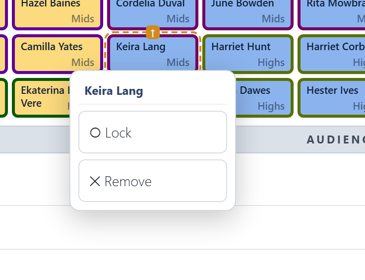

# Arranging

**Auto-arrange** and **Compact** reseat singers as soon as you click them.

## ↻ Auto-arrange

Auto-arrange seats everyone, including the waiting area, so that **each singer has someone from each of their groups next to them**: in their section, and in every split. It tries for a neighbour **beside** them, and settles for one in front or behind.

- **Locked singers** stay in their chairs, and the arrangement works round them.
- **Blocked chairs** stay where they are and are never sat in.
- If there aren't enough chairs, the extras stay in the waiting area.
- The same choir always gets the same result: same singers, splits, grid, locks and blocked chairs, same seating.

A good way to work:
1. Auto-arrange.
2. Move the few people who must be somewhere in particular, like the soloist at the end or the tallest singers at the back.
3. **Lock** them.
4. Auto-arrange again.

## Section order

**Section order** is the order Auto-arrange puts the sections in, left to right as the audience sees the stage. The arrows on a section move it one place left or right. Changing it moves nobody until you next Auto-arrange.

Section order is **part of the seating plan**, not a setting for the whole tool: each plan keeps its own, so two plans in one concert can stand in different orders. **Duplicate** copies it into the new plan.

## ⇤ Compact

Compact closes up the gaps, packing everyone toward the front left. It keeps everyone in the same order, and locked singers and blocked chairs stay put. It doesn't try to improve anyone's neighbours. Use it after removing people, to tidy up without reshuffling.

## Moving singers

- **Drag** a singer onto another chair to swap them.
- **Click or tap** a singer for a menu:
  - **Lock** keeps them in that chair when you auto-arrange. Locked chairs show a 🔒 and a striped fill. Choose **Unlock** to release them.
  - **Remove** sends them to the waiting area.

## The waiting area

Under the stage, the waiting area holds singers in this concert who have no chair. Drag one onto a chair to seat them, or drag a seated singer here to take them off the stage. **Auto-arrange** seats everyone here if there are enough chairs.

## Block and Space

Drag [⊘ Block]{.tool .block} or [⇥ Space]{.tool .space} onto a chair. The rest of that row moves one seat to the right. If there is no empty chair to take up the slack, the last singer in the row goes to the waiting area.

- **Space** leaves an empty chair.
- **Block** marks a spot nobody can sit in, like a pillar or an aisle. It stays put when you auto-arrange.

Click or tap an empty or blocked chair to remove it and close the gap: the row moves back to the left.

## Checking the result

After arranging, look at the [Neighbour check](neighbour-check.md) under the stage. With a sensible grid it usually says **everyone has a neighbour**. When the arranger can't manage that (a group of two in a choir split six ways, say), the check shows you who is affected.
