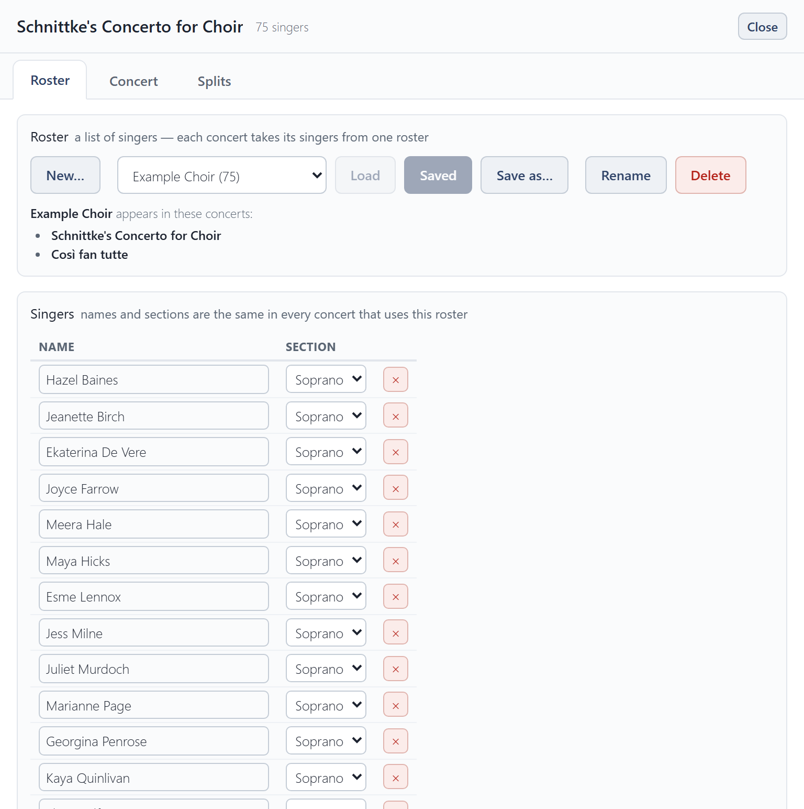
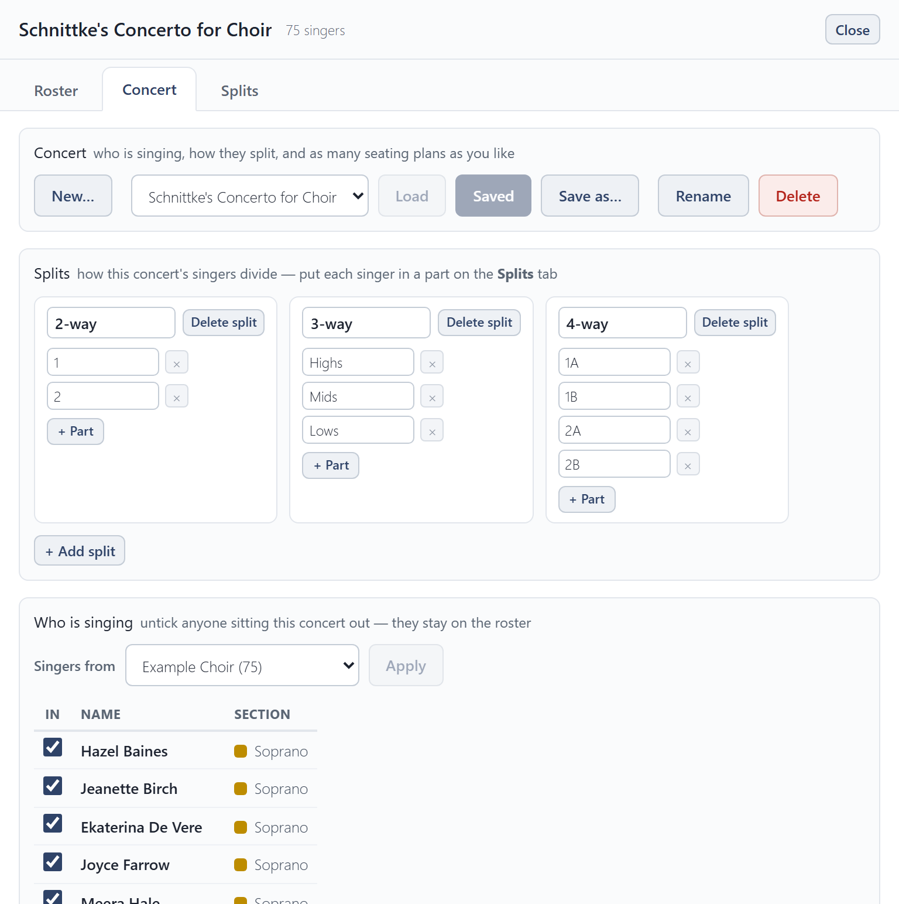
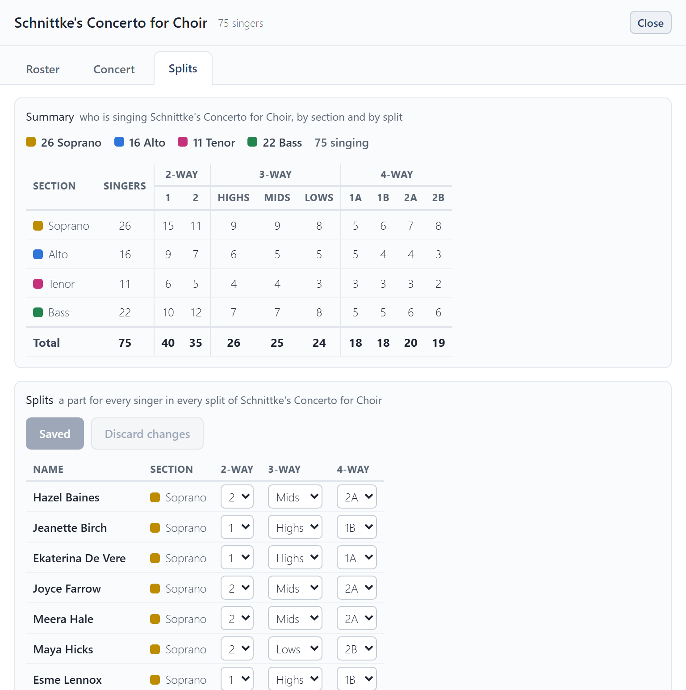

# Choir setup

**Choir setup**, at the top right, is where the choir itself lives. It has three tabs: **Roster**, **Concert** and **Splits**.

Each tab works on a copy. Choose a roster or concert in its list and press **Load**, make your changes, then **Save**. If you leave a tab or close the window with changes you haven't saved, it asks whether to save or discard them.

## Roster

A roster is a list of singers: each one's name and section. A concert takes its singers from one roster, so a correction to somebody's name here is right in every concert that uses it.

- **New…** starts an empty roster. **Save as…** copies the one you have open.
- To add a singer, press **+ Add singer** under the list, type their name over **New singer** and choose their section. **×** removes a singer.
- **Import roster…** reads names and sections from an Excel workbook (`.xlsx`) or a CSV file. **Export roster** saves the roster as a spreadsheet you can open in Excel or import again.

## Concert

A concert is one performance: which roster it uses, who is singing, its splits, and its seating plans.

- **Splits** sets how the sections divide (see below).
- **Who is singing**: tick the singers in this concert. Anyone unticked stays on the roster for next time.
- **Guests** sing this concert only and are not added to the roster.

### Splits

Pieces often divide the sections further: an SSAATTBB piece splits each section in two. A **split** is one of those ways of dividing, such as a 2-way split into 1 and 2, or a 3-way split into Highs, Mids and Lows. Add one for each way your pieces divide, and name its parts.

**Auto-arrange** seats each part together in every split at once, so one seating works for the whole concert.

## Splits tab

The **Splits** tab says which part each singer sings in every split. The **Summary** at the top counts who is singing, by section and by split, so you can check the balance.

## The examples

Choir Seating Tool comes with an example choir, the **Example Choir**, and two example concerts, **Schnittke's Concerto for Choir** and **Così fan tutte**. Each has two seating plans, so you can see what a finished setup looks like. They are yours to change or delete like anything else. **Clear everything** in [Settings](settings-and-backup.md) puts them back as they were, deleting everything else.
