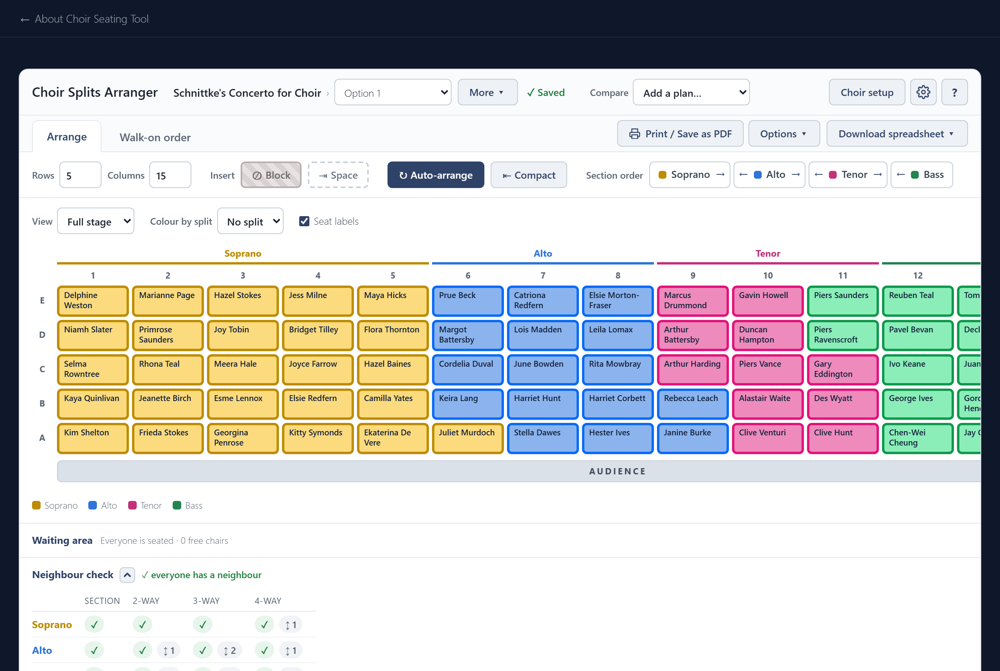

# Getting started

Choir Seating Tool arranges a choir on stage so that **every singer sits next to someone singing the same part**, in every piece of the concert at once. You set up your choir, it works out a seating, and you adjust it by hand.

It runs in your browser, or as an app on a Windows computer. There is no account and nothing is sent anywhere: your choir is saved on your own device. [Settings and backup](settings-and-backup.md) explains where, how to move it to another device, and how to get the app.

## A first plan in four steps

1. **Set up the choir.** Add your singers, make a concert and say how the sections split. See [Choir setup](choir-setup.md).
2. **Arrange.** Set the size of the stage and press **Auto-arrange**. See [Arranging](arranging.md).
3. **Adjust by hand.** Drag singers to swap them, and lock the ones who must stay put. See [Moving singers](arranging.md#moving-singers).
4. **Print and export.** Print the plan or save it as a PDF, or export it as a spreadsheet. See [Printing and export](print-and-export.md).

Under the stage, the [Neighbour check](neighbour-check.md) tells you whether anyone has been left without a neighbour, and shows you who.
