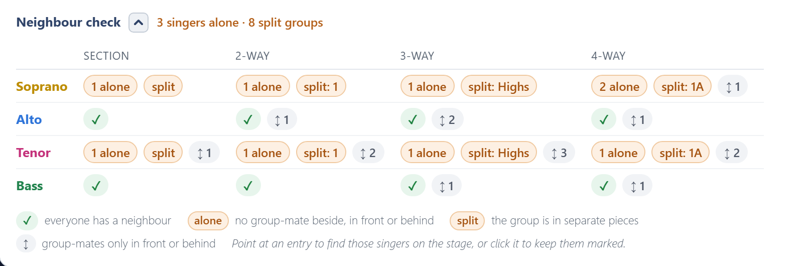
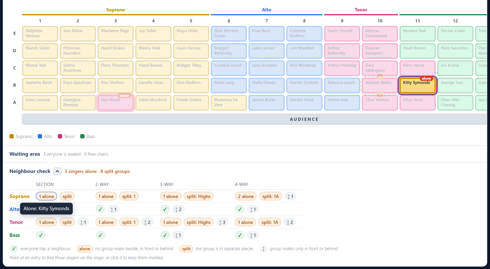

# Neighbour check

The neighbour check, under the stage, checks every section and every split on the real grid: left, right, in front and behind. Its header gives the answer even while it is folded away. It reads **everyone has a neighbour**, or says how many singers are alone and how many groups are split up.

There is one row per section and one column per split. Each cell shows what it found:

| Mark | Meaning |
| --- | --- |
| **✓** | Everyone in this section has a group-mate next to them in this split. |
| **2 alone** | Singers with nobody from their group beside, in front or behind. A problem. |
| **split: 1st** | That group is on stage in more than one separate piece. A problem. |
| **↕ 3** | Singers whose group-mates are only in front or behind, nobody beside. Allowed, just less comfortable to sing in. |

A group of one is never counted as alone, because there is nobody to sit them next to.

## Finding them on the stage

**Point at any entry**, or tab to it with the keyboard, and the stage rings those singers and fades everyone else. For a split group, it rings the whole group, so you can see its separate pieces; a ↕ also rings the group-mates in front or behind; a ✓ rings the whole section. While you point, the stage is coloured and marked by that entry's split, whatever **Colour by split** is set to.

**Click an entry** to keep those singers marked while you scroll to the stage or move people around. A **Marked** pill above the stage names it; click its **×**, or the entry again, to let go.

The stage also marks problems all the time, for the section and for the split you are colouring by:

- A red outline and an **alone** tag: a singer with nobody from their group next to them.
- A dashed amber outline: a singer with group-mates only in front or behind. An arrow in the gap points from them to each of those group-mates, or ↕ when two such singers are each other's group-mate.

Hover over a marked chair for what it means.

## Printing it

To add the check to the printed plan, tick **Include the neighbour check** in the print options. It prints on its own page, with the names written out.
