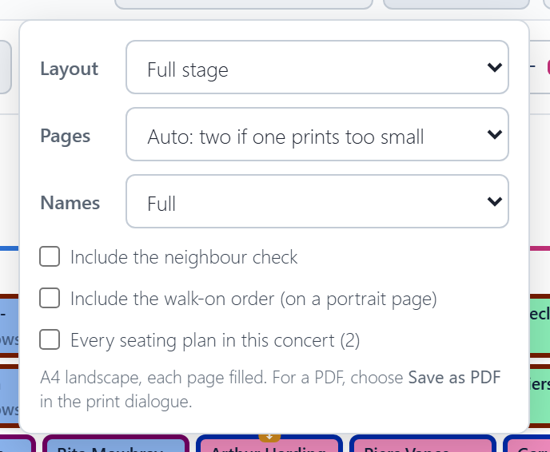
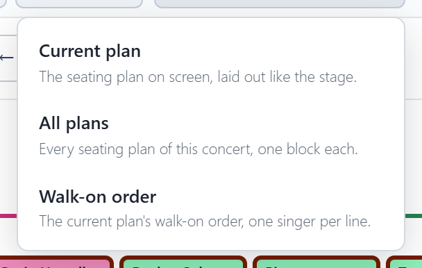
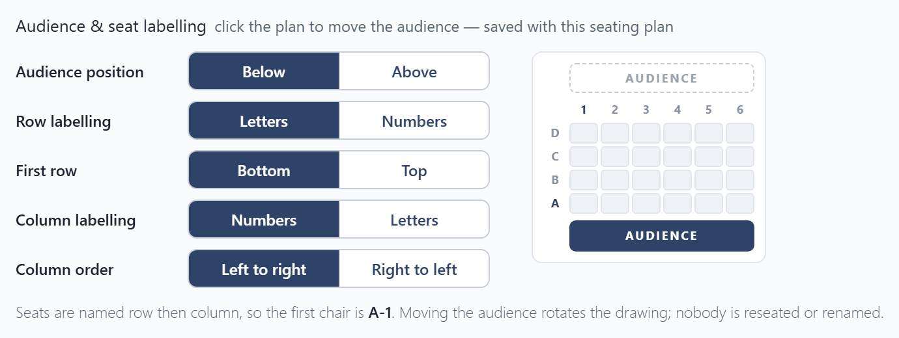

# Printing and export

## Print / Save as PDF

**Print / Save as PDF** prints the seating plan on the stage, A4 landscape, filling the page. For a PDF, choose **Save as PDF** in the print dialogue.

**Options** beside it:

- **Layout**: the full stage, or a page per section.
- **Pages** (full stage only): **One**, **Two** (the left and right halves, to put side by side), or **Auto**, which uses two pages when one would print the names too small to read.
- **Names**: full names, or first name and initial ("Ekaterina D."). Shorter names print larger, so the plan is easier to read at arm's length. Where two singers would come out the same, like Selma Rowntree and Selma Rose, both keep their full names.
- **Include the neighbour check**, on its own page.
- **Include the walk-on order**, on a portrait page.
- **Every seating plan in this concert**, when it has more than one.

A **!** on the Options button means the names would print small, and the options say what to change.

## Export

**Download spreadsheet** saves a CSV file, which opens in Excel, for printing or emailing:

- **Current plan**: the seating plan on screen, laid out like the stage.
- **All plans**: every seating plan of the concert, one block each. Shown when the concert has more than one.
- **Walk-on order**: the current plan's walk-on order, one singer per line.

These files are for reading and printing; the app can't load them back in. To keep a copy of your plans or move them to another device, use a [backup file](settings-and-backup.md), which restores everything.

## Which way round

By default the plan is drawn as the audience sees it, with the audience at the bottom. In **Settings** you can draw it as the choir and conductor see it instead, with the audience at the top. You can also choose how chairs are labelled (like B-7): letters or numbers, and which corner is 1. Only the drawing turns; nobody moves. A printed plan shows the audience bar on the side the audience is, and a spreadsheet export names the viewpoint in its first line.

