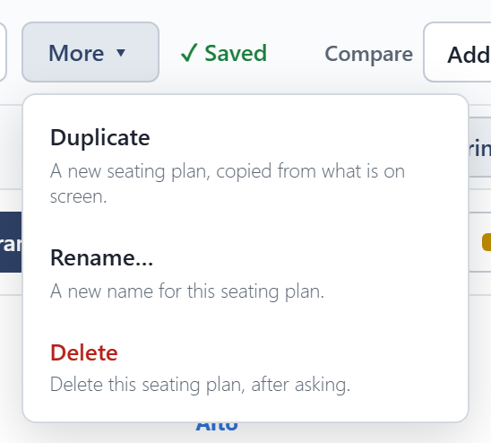
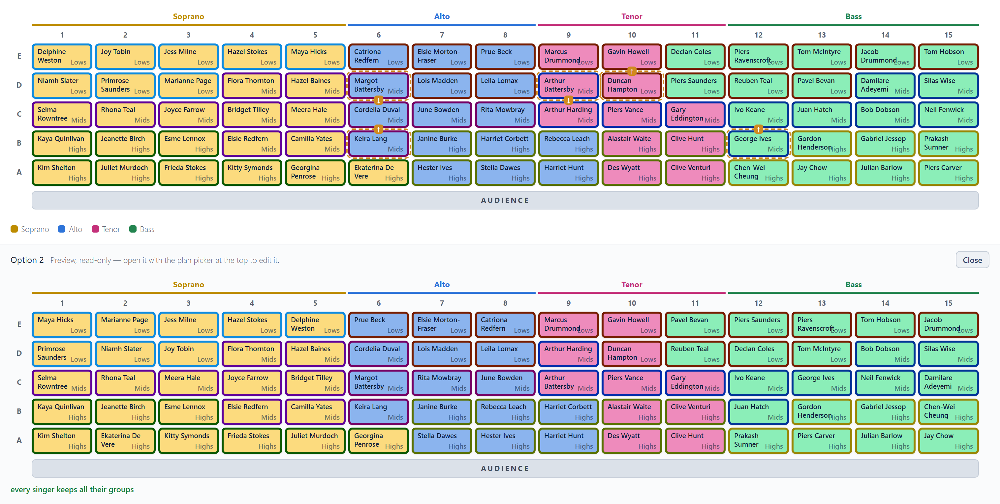

# Seating plans

A concert can have as many seating plans as you like: one per piece, or a few ideas to compare. The picker at the top, beside the concert's name, chooses the one on the stage.

## Saving

Changes on the stage are yours to keep or not. **Save changes** appears beside the picker when there is something new, and writes it into the plan; otherwise it reads **Saved**. Switching to another plan with unsaved changes asks first.

**More** holds what is done to a plan now and then:

- **Duplicate** makes a new plan from what is on the stage, including any unsaved changes, and leaves the original as it was saved.
- **Rename…** and **Delete** work on the open plan. A concert always keeps at least one plan.

## Compare

**Compare** shows another plan, from this concert or any other, below the stage so you can compare them. Previews can't be edited. You can add as many as you like, and close each one when you are done.

In **By section** view, each section shows the same section from every preview beside it.

{.wide}
