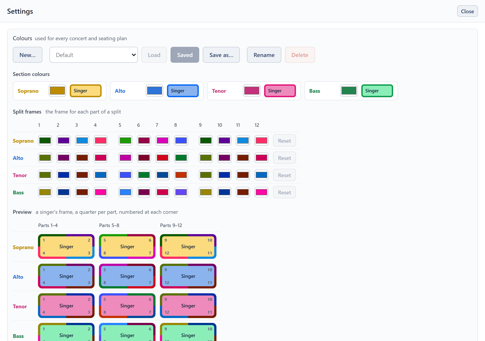

# Settings and backup

The **cogwheel** beside **Choir setup** opens **Settings**.

- **Colours**: named colour schemes, the same in every concert.
  - **Section colours**: the fill of each section's seats.
  - **Split frames**: the frame colour for each part of a split, a row per section. A split's first part uses column **1**, its second column **2**, and so on.
  - **Preview**: a singer from each section with its frame in four quarters, one per part, numbered at the corners, so you can see how the frames look on that section's fill.
- **Audience and seat labelling**: which way round the plan is drawn and how chairs are labelled. See [Printing and export](print-and-export.md#which-way-round).
- **Backup and restore** (below).

## Where your work is kept

Everything is saved as you go, so it is still there when you come back. But it lives **only where you made it**:

- **In a browser**, it is kept in that browser, on that device. Clearing the browser's site data, or using a private window, loses it.
- **In the Windows app**, it is kept on that computer, separately from any browser. Updating the app, or replacing its file with a newer one, leaves it as it is.

Nothing made in one place appears in another by itself. A backup file is how it moves.

## Backup and restore

- **Save backup file** writes every roster, concert, seating plan and colour scheme into one file. Keep it somewhere safe, or take it to another device.
- **Restore from backup** loads a backup file, replacing everything Choir Seating Tool holds here.
- **Clear everything** deletes every roster, concert and seating plan and starts again from the example choir. Your colour schemes are kept.

Save a backup before a big change, and whenever you have done work you wouldn't want to lose.

## Use it as an app, and offline

Choir Seating Tool can open in a window of its own, with its own icon, in place of a browser tab. There are two ways, and both work without an internet connection, manual included.

### Install it from the browser

- **Computer or Android** (Chrome or Edge): click **Install app** at the top of the page. The browser's own menu has it too, as **Install Choir Seating Tool** or **Add to Home screen**.
- **iPhone and iPad** (Safari): tap **Share**, then **Add to Home Screen**.

On a computer or Android the installed app shares the browser's storage, so your work is already there. In a browser tab, too, Choir Seating Tool works offline once it has been opened.

### Download the Windows app

The [download page](https://jordanbarnes.uk/projects/choir-seating/download/) has Choir Seating Tool for Windows 10 and 11, in two forms:

- **The one file** needs no installing: double-click it. Keep it wherever you like.
- **The installer** adds it to the Start menu.

The Windows app starts on the example choir, because it keeps its work separately from your browser's. To bring your work across, use **Save backup file** in the browser, then **Restore from backup** in the app. Files you save from it (backups, spreadsheets) go to your Downloads folder.

Neither way backs anything up: your work is still kept only on this device.

> **On an iPhone or iPad the installed app has its own storage**, separate from Safari's. It opens on the example choir, not on what you made in Safari. To bring your work across, use **Save backup file** in Safari, then **Restore from backup** in the installed app.

## New versions

- **In a browser, or installed from one:** when a newer version has been downloaded, a notice at the top of the page offers to **Reload**. You can finish what you are doing first. If you don't reload, the new version starts the next time you open Choir Seating Tool after closing it.
- **The Windows app** checks as it opens, when there is an internet connection, and asks before doing anything. Installed, it offers to update itself, which closes it and opens it again. The one file offers the download page: download the new file and use it in place of the old one.

No update changes your work.
