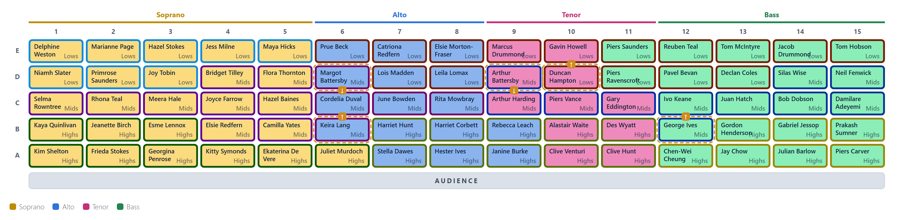
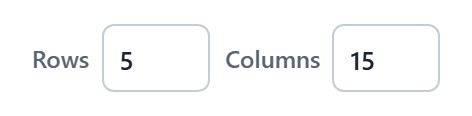

# The stage

The stage is a fixed grid of chairs, drawn as the audience sees it: the **front row is at the bottom**, nearest the audience. Each chair is filled with its singer's section colour.

{.wide}

## Views

**View**, over the stage, draws it one of two ways:

- **Full stage** shows every chair.
- **By section** shows each section on its own, cut out of the same stage with everyone else greyed out.

**Colour by split** picks one split to show as a coloured frame round each chair, so you can see where each part of that split sits. It only changes the colours: the arranger always seats for every split at once.

**Seat labels** shows or hides the row and column headings round the full stage.

## Grid size

**Rows** and **Columns** set the size of the stage. Changing them keeps everyone in their chair; anyone left off the edge goes to the waiting area.

To move singers, fill the stage automatically, or leave gaps in it, see [Arranging](arranging.md).
