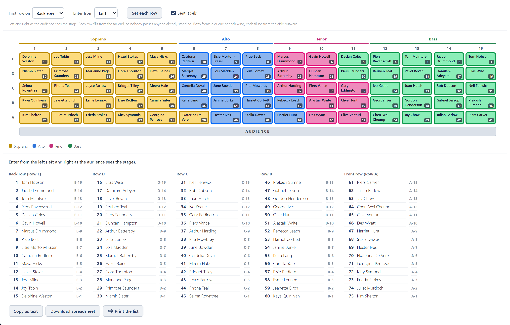
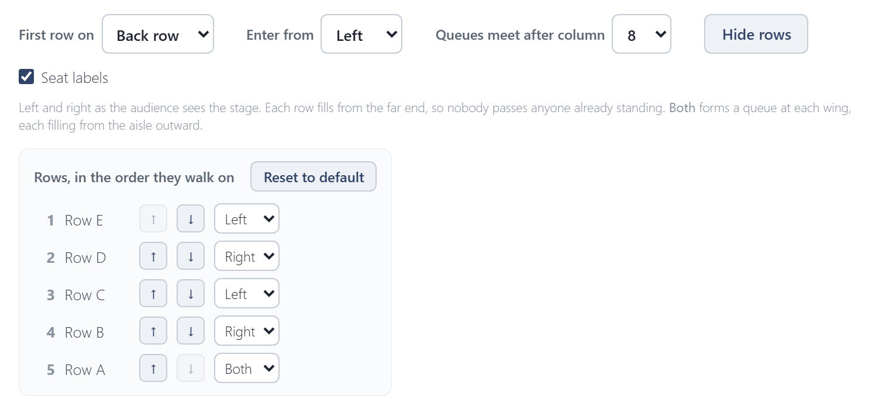

# Walk-on order

The walk-on order is the order singers file onto the stage, so a queue can form backstage. It has its own tab: click **Walk-on order** beside **Arrange**, above the stage. The tab shows the walk-on settings, the stage with every chair's number in the queue in its bottom-right corner, and the list. The stage there is for checking, not arranging: to move someone, go back to **Arrange**, where the split labels show again.

{.wide}

- **First row on**: the back row or the front row first.
- **Enter from**: the left or right wing, as the audience sees the stage, or **Both**. **Both** makes two queues, one at each wing, that meet at the aisle; choose which column they meet after.
- Each row fills from the far end, so nobody squeezes past anyone already standing.

## Setting each row

**Set each row** lists the rows in the order they walk on. The arrows move a row earlier or later, and the picker beside them gives it its own direction: **Left**, **Right** or **Both**. **Reset to default** puts every row back to **First row on** and **Enter from**.

{.wide}

## Taking the list away

The list underneath is the queue:
- **Copy as text** puts it on the clipboard, for an email or a document.
- **Download spreadsheet** saves it as a CSV file, which opens in Excel.
- **Print** prints it on its own, A4 portrait, one column per row.
